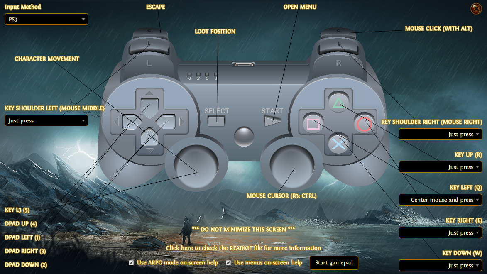
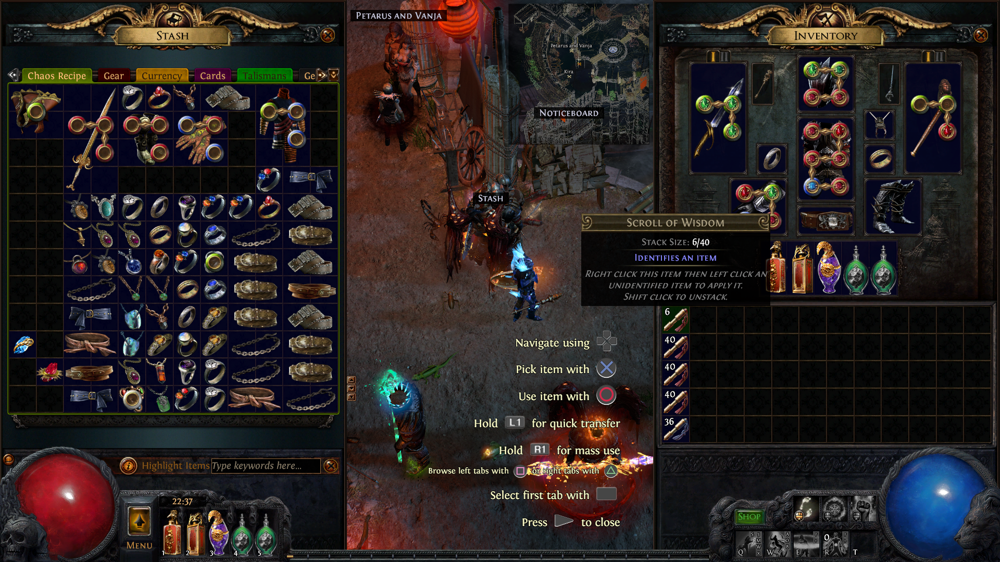
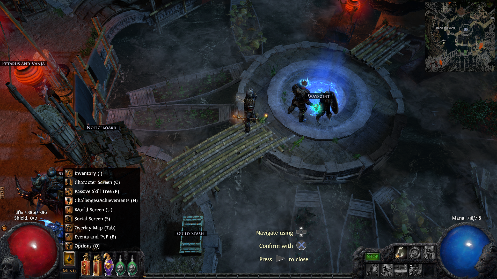

#PoEController

An easy way to play [Path of Exile](http://www.pathofexile.com/) with a gamepad.

##Goals

The main problem with using a gamepad in Path of Exile is that the game is in no way designed to be friendly to few key bindings. It heavily focuses use of the mouse cursor and several key bindings for optimal gameplay.

Many people provided solutions to play Path of Exile with a gamepad before. However, the main focus of this solution is to reduce the need of using a gamepad input as a mouse cursor to a minimum.

##Solution

The provided solution focus on mimicking the input methods of another similar game on game consoles, [Diablo 3](http://us.battle.net/d3).

So the focus is to give the players one thumbstick for character movement, some keys bound to access menus and freedom to bind the other keys to his character's abilities.

(Notice that you can hide the help overlay text in the main menu!)

##How it works

The application detects what I called "pixel signatures" from the screen in an attempt to adjust the input methods accordingly to whats needed to be done by the player.

As you can see here, when a player opens his stash, and the application detects it, the input methods change drastically compared to the previous screenshot:

This solution has several drawbacks. It costs a lot, in terms of performance, and this asynchronous type of state detection creates an error prone environment, which leads to being an application hard to work in. My hopes lies with [GGG](http://www.grindinggear.com/) and the player community seeing this as a viable option to play the game and providing the necessary support to make this in the best possible way (APIs, add-on support, etc).

##General tips

- The application works better with the Steam's Path of Exile client version, since it tries to open it via steam link.
- Path of Exile's configuration file is rewritten on opening the application and restored when exiting it. There are some expected configurations for this to work properly. One of them is that the game will run in windowed fullscreen.
- While playing the game in ARPG mode, notice a red circle in the middle of the screen. Holding the "select" key will bring the mouse there while holding the game highlight key. Use the right trigger on the gamepad to loot and item there. This tries to mimic a common behaviour in old beat'em up games, where you had to position your character above an item on the ground and press a button to "loot" it.
- There will be times where you will be stuck (maybe between two hideout's masters or in a zone entrance) and will need to use the right thumbstick as mouse. It is minimal, but it happens.
- Sometimes you will also need to use the right thumbstick to loot. My advice is to position the red circle as close as possible to the item. This position paired with the "loot key" will provide minimal mouse movement to loot.
- This mod is better enjoyed for players who just like to chill on the couch.

## Mapped modes

- Stash
- Inventory
- World map (Waypoint)
- Passive skill tree
- Craft benches
- Game default mode (named as ARPG mode)
- Quest rewards

## Requirements

### Supported resolutions

- 1360x768
- 1366x768
- 1600x900
- 1920x1080

### Gamepad

The application fallbacks to the XBOX 360 controller driver. All gamepads that can work as such will work with the application. That is one of the reasons that the PS3 game overlay was implemented (eg: PS3 gamepad can work as XBOX 360 gamepad with [ScpToolkit](https://github.com/nefarius/ScpToolkit)).

## Known issues

- Don't try to make an action too quickly after accessing the options menu ("start" key on ARPG mode). It can bug and the application can think that you are in a mode (eg: inventory) but there isnt any related UI being displayed. If this happens, press the "start" key to go back to ARPG mode. This bug only happens if you are really quick on accessing a mode after opening the menu (aka: almost simultaneously).

 
