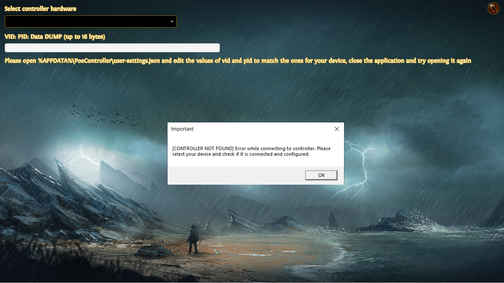
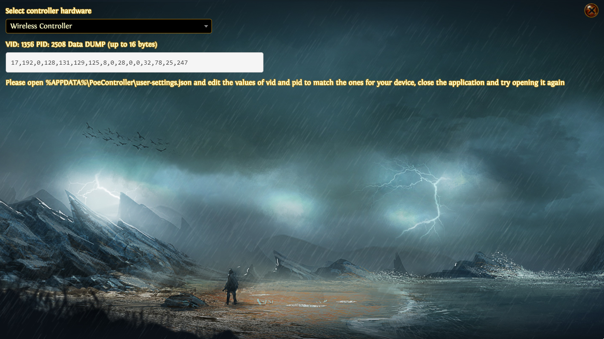

# Developer's Guide

This application was made in the past just to allow some players to experience Path of Exile with a gamepad. When it was made, there was no console version of the game and some attempts were made to add a gamepad to it.

Currently (September 2020), this application servers as an accessibility tool to some people to play the game.

The version v2.0 of this project was built using ElectronJS (version of the libraries in package.json), node v12.18.3 and npm v6.14.6.

The following steps are required to get the application running on your end, after installing node, npm and git:

- clone from github

```
git clone https://www.github.com/csiqueirasilva/PoEController
```

- to the usual install command to install dependencies

```
npm install
```

- this replace the old nw-gyp stuff (builds native libraries to work with electron):

```
.\node_modules\.bin\electron-rebuild.cmd
```

- to initialize the application:

```
npm start
```

# configuration file 

The configuration file for the application resides in ***%APPDATA%\PoeController\user-settings.json**.

```
{
	"debug": false, /* sets the debug mode on */
	"steamGame": false, /* sets that the game should run by steam id, opening within steam */
	"gamePath": "C:\\Games\\Path of Exile\\PathOfExile_x64.exe", /* sets the gamepath for standalone */
	"gameConfigPath": "%USERPROFILE%\\Documents\\My Games\\Path of Exile\\production_Config.ini", /* sets the game config path */
	"inputFunctions": { /* old user-settings, with selected input modes; might not be working */
		"input":"xbox",
		"q":"arpg.nothing",
		"w":"arpg.nothing",
		"e":"arpg.nothing",
		"r":"arpg.nothing",
		"right":"arpg.nothing",
		"middle":"arpg.nothing"
	},
	"vid": 0, /* the vid of the gamepad */
	"pid": 0, /* the pid of the gamepad */
	"bluetooth": false /* check if gamepad is bluetooth */
}
```

The input translators should reside in **src/game/inputs/**, in the format of i<vid>_<pid>.js with the application shipping with i1356_2508.js for PS4 controller (its what I have to test currently).

If your controller is not detected, it opens a new interface where you can select the detected usb devices and check the pid/vid for it (and also it writes the first 16 bytes of data from the buffer, so you can do some quick input tests and check whats been read in binary data).





Notice that for the printed array might differ if your device is on bluetooth mode or not. I did the following fix on i1356_2508.js to solve it:

```
function handleInput(data) {
	var ret = null;

	if(Settings.bluetooth) {
		data = data.slice(2);
	}
	
	(...)
```

This might differ from each type of input.

# IMPORTANT

When adding your own device to the application, some mistakes might be made when correctly identifying each data byte and emitting events to Input.js (that handles inputs in an abstract way). To avoid system wide failures (due to many keyboard presses or mouse clicks being made), I suggest that you attempt to add each button at a time and when safe, move to the next. This method might prevent your computer from crashing while testing the gamepad input in early stages.